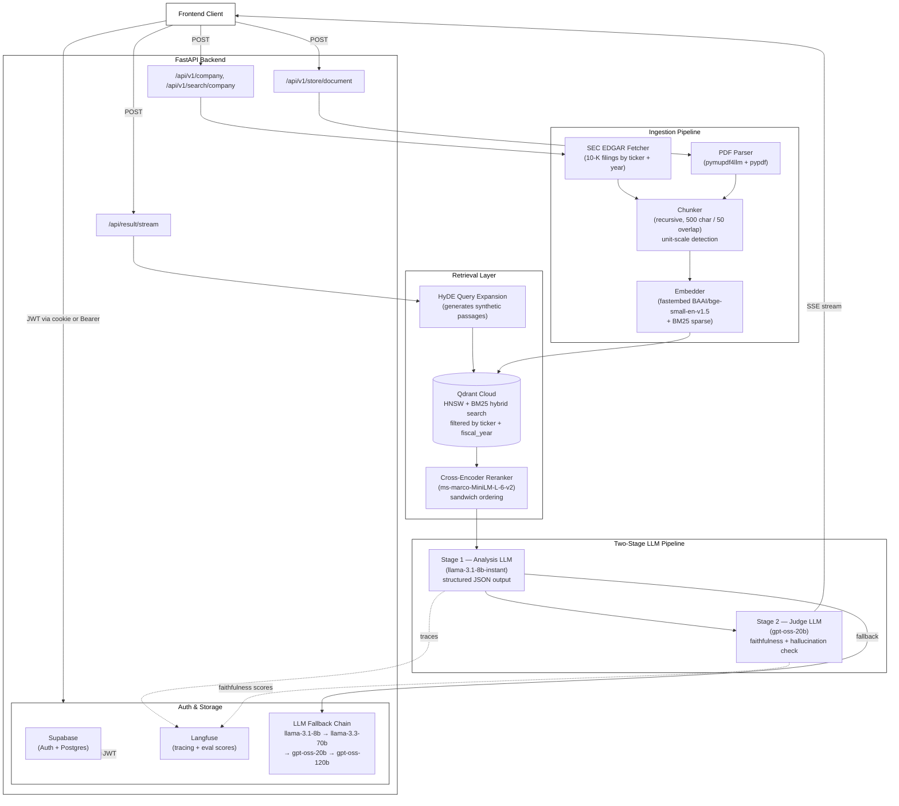
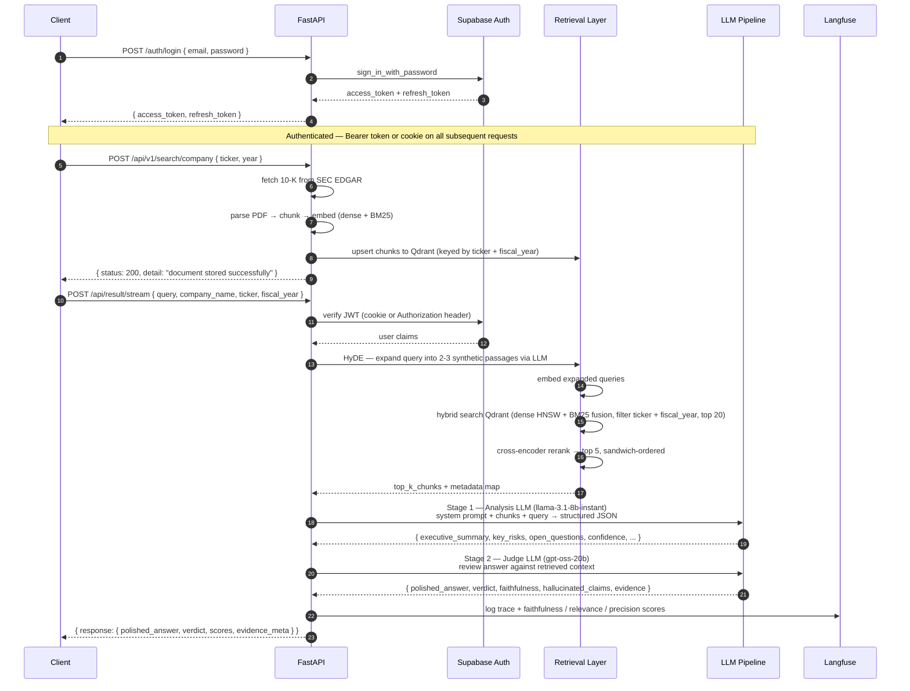

# Diligence Analyst

An AI-powered due diligence assistant that helps investors quickly identify risks, red flags, and high-signal questions when evaluating startups — grounded strictly in uploaded documents and SEC filings.

---

[](https://youtu.be/EnMEWKI6HxY?si=X6meMoV4potQG2-C)

> **▶ [Visit Video](https://youtu.be/EnMEWKI6HxY?si=X6meMoV4potQG2-C)** &nbsp;|&nbsp; **▶ [Visit Live App](https://diligence-mauve.vercel.app/)**

---

> **Test credentials**
>
> Email: `bishtrahulsingh.dev@gmail.com`
> Password: `123456`

---

## Overview

Early-stage due diligence is slow and manual. Pitch decks make big claims but hide gaps, key risks are easy to miss, and analysts spend hours just building context before they can make any judgment calls.

This system accelerates the first round of diligence by:

- Summarizing a startup's narrative from its own documents and SEC filings
- Highlighting potential red flags grounded strictly in retrieved context
- Generating high-signal questions an investor should ask before committing time or capital

Everything is grounded in uploaded context. If the documents don't contain enough information to answer a query, the model says so rather than guessing.

---

## Architecture



---

## Request Flow (Sequence)



---

## Key Features

- **Two-stage LLM pipeline** — A generator model produces a structured JSON analysis; a dedicated judge model reviews every claim for faithfulness against the retrieved context before the response reaches the client.
- **HyDE query expansion** — Hypothetical Document Embeddings expand the user query into 2–3 synthetic passages, improving recall for conceptual and analytical questions against SEC filings.
- **Hybrid retrieval with reranking** — Dense HNSW search and BM25 sparse search are fused via Qdrant, then a cross-encoder reranker (ms-marco-MiniLM-L-6-v2) reorders the top 12 candidates into a sandwich arrangement to put the strongest context at both ends of the prompt.
- **SEC EDGAR ingestion** — 10-K filings are fetched directly from the SEC by ticker and fiscal year, parsed with pymupdf4llm, chunked with unit-scale detection (thousands/millions/billions), and embedded without any external embedding API.
- **LLM fallback chain** — If the primary model is unavailable, `LLMWrapper` automatically falls through `llama-3.1-8b-instant → llama-3.3-70b-versatile → gpt-oss-20b → gpt-oss-120b`, controlled by a semaphore (max 10 concurrent calls).
- **JWT authentication with auto-refresh** — All protected routes verify a Supabase JWT from either a cookie or a Bearer header; expired tokens are silently refreshed and new cookies are set on the response.
- **Full observability** — Langfuse traces every observation span across HyDE retrieval, generation, and judge evaluation, with per-call faithfulness, answer relevance, and context precision scores.
- **Anti-hallucination by design** — The system prompt enforces a strict JSON schema with explicit rules: if confidence is below 0.5, `key_risks` and `open_questions` fields are omitted entirely rather than fabricated.
- **Monorepo with shared core** — A `diligence_core` package handles all shared logic (embeddings, chunking, Qdrant ops, LLM wrapper, auth middleware) and is installed as a local editable dependency by the app layer.

---

## Analysis Output Schema

The judge model enforces this structure. Low-confidence responses omit `key_risks` and `open_questions` entirely:

```json
{
  "executive_summary": "2-4 line investor-grade summary answering the query directly",
  "key_risks": [
    { "risk": "Specific risk grounded in retrieved context", "severity": "low | medium | high" }
  ],
  "open_questions": ["Critical unknowns that block decision-making"],
  "confidence": 0.85,
  "summarized_query": "Short restatement of the query",
  "summarized_context_used": ["Key facts extracted from retrieved chunks"],
  "verdict": "supported | unsupported | hallucinated",
  "faithfulness": 0.92,
  "answer_relevance": 0.88,
  "context_precision": 0.76,
  "hallucinated_claims": [],
  "evidence": {
    "supporting_chunk_index": 2,
    "contradicting_chunk_index": null
  }
}
```

Confidence thresholds: `0.9–1.0` strong evidence, `0.6–0.8` moderate support, `0.3–0.5` weak support, `<0.3` context insufficient.

---

## Tech Stack

| Layer | Technology |
|---|---|
| API Framework | FastAPI, Uvicorn |
| LLM Provider | Groq (llama-3.1-8b-instant, llama-3.3-70b-versatile, gpt-oss-20b, gpt-oss-120b) |
| Embeddings | fastembed — BAAI/bge-small-en-v1.5 (dense) + Qdrant/bm25 (sparse) |
| Vector Database | Qdrant Cloud (HNSW + BM25 hybrid, cosine similarity) |
| Reranker | fastembed TextCrossEncoder — Xenova/ms-marco-MiniLM-L-6-v2 |
| Auth & Persistence | Supabase (Auth + Postgres) |
| PDF Parsing | pymupdf4llm, pypdf, fitz |
| SEC Data | python-edgar (10-K filings by ticker + year) |
| Observability | Langfuse (tracing + eval scoring) |
| Deployment | Azure Web App (GitHub Actions CI/CD) |
| Package Management | pip + pyproject.toml monorepo |
| Containerization | Docker, Docker Compose |

---

## Repository Structure

```
gen-ai-monorepo/
├── apps/
│   └── p1_diligence_analyst/
│       └── diligence_analyst/
│           ├── main.py                        # App factory + router registration
│           ├── routers/
│           │   ├── streamingrouter.py         # POST /api/result/stream — HyDE + rerank + two-stage LLM
│           │   ├── documentrouter.py          # POST /api/v1/store/document — PDF ingestion
│           │   ├── companyrouter.py           # POST /api/v1/company, /search/company — EDGAR fetch + embed
│           │   └── userauthrouter.py          # POST /auth/login, /register, /logout
│           ├── prompts/p1_memo/
│           │   ├── system_template_model1.md  # Stage 1 analysis system prompt
│           │   ├── system_template_judge1.md  # Judge faithfulness review prompt
│           │   └── input_template.md          # User prompt template (query + chunks)
│           ├── schemas/                       # Pydantic request/response models
│           └── evaluation/
│               └── goldendataset.py           # Golden QA pairs for eval runs
│
├── packages/
│   └── core/
│       └── diligence_core/
│           ├── llm/llmwrapper.py              # LLMWrapper — HyDE, fallback chain, semaphore
│           ├── chunkingpipeline/              # PDF reading, recursive chunking, unit-scale detection
│           ├── embeddings/                    # fastembed dense + BM25 sparse generation
│           ├── vectordb/qdrantConfig.py       # Qdrant collection management, hybrid search, upsert
│           ├── reranker/commonreranker.py     # Cross-encoder reranker + sandwich ordering
│           ├── edgarfilefetching/             # SEC EDGAR 10-K fetcher by ticker + fiscal year
│           ├── middlewares/authmiddleware.py  # JWT verify + silent token refresh
│           ├── supabaseconfig/                # Async Supabase client + admin client
│           ├── eval_system/observability/     # Langfuse tracer + span management
│           └── utilities/settings.py         # pydantic-settings env config
│
├── scripts/
│   └── run_golden_dataset.py                 # Offline eval runner against golden QA dataset
├── eval_results/                             # Timestamped eval JSON outputs
├── Makefile                                  # run-p1, test, lint, docker-build targets
├── Dockerfile
└── .github/workflows/azure-deploy.yml       # CI/CD — build + deploy to Azure Web App
```

---

## API Endpoints

| Method | Endpoint | Auth | Description |
|---|---|---|---|
| `POST` | `/auth/register` | — | Register a new user (Supabase) |
| `POST` | `/auth/login` | — | Login — returns access + refresh token |
| `POST` | `/auth/logout` | — | Logout |
| `GET` | `/health` | — | Health check |
| `POST` | `/api/result/stream` | JWT | HyDE retrieval + two-stage LLM analysis |
| `POST` | `/api/v1/store/document` | JWT | Ingest a PDF document into the vector store |
| `POST` | `/api/v1/search/company` | JWT | Fetch 10-K from SEC EDGAR, chunk, and embed |
| `POST` | `/api/v1/company` | JWT | Create a company record in Supabase |
| `GET` | `/api/v1/company/distinct` | JWT | List all stored companies |
| `POST` | `/api/v1/storage/documents` | JWT | List stored documents by ticker + fiscal year |
| `POST` | `/api/v1/storage/documents/years` | JWT | List available fiscal years for a ticker |

Interactive docs: `http://localhost:8000/docs`

---

## Running Locally

### Prerequisites

- Python 3.11+
- Groq API key
- Qdrant Cloud account
- Supabase project (Auth + Postgres)
- Langfuse account (optional, for observability)

### Setup

```bash
git clone https://github.com/Bishtrahulsingh/gen-ai-monorepo.git
cd gen-ai-monorepo

# Create venv and install all packages
make install

# Configure environment
cp .env.example .env
# Fill in your keys (see Environment Variables below)

# Start the server with hot reload
make run-p1
```

The API will be available at `http://localhost:8000`.

### Make Commands

| Command | Description |
|---|---|
| `make install` | Create venv, install core + app in editable mode |
| `make install-dev` | Same as install + pytest, httpx |
| `make run-p1` | Start FastAPI with hot reload on port 8000 |
| `make test` | Run all tests across core and app |
| `make lint` | Lint with ruff |
| `make format` | Format with ruff |
| `make docker-build` | Build Docker image |
| `make docker-run` | Run Docker image locally |

### Environment Variables

| Variable | Description |
|---|---|
| `GROQ_API_KEY` | Groq API key |
| `QDRANT_API_KEY` | Qdrant Cloud API key |
| `COLLECTION_NAME` | Qdrant collection name (e.g. `sec_filings`) |
| `SUPABASE_URL` | Supabase project URL |
| `SUPABASE_ANON_KEY` | Supabase anon/public key |
| `SUPABASE_ADMIN_KEY` | Supabase service role key |
| `SECRET_KEY` | JWT signing secret |
| `LANGFUSE_PUBLIC_KEY` | Langfuse public key |
| `LANGFUSE_SECRET_KEY` | Langfuse secret key |
| `LANGFUSE_BASE_URL` | Langfuse host URL |
| `FRONTEND_URL` | Allowed CORS origin |
| `DEBUG` | Enable debug logging |

---

## Deployment

The app is containerized and deployed to Azure Web App via GitHub Actions on every push to `main`:

```bash
docker compose up -d --build
```

The CI pipeline installs the monorepo packages, zips the artifact, and deploys to the `duediligence` Azure Web App slot using `azure/webapps-deploy`. All secrets are injected as Azure App Settings at deploy time.

---

## Evaluation System

A golden dataset of QA pairs can be run offline against the live retrieval + LLM pipeline:

```bash
python scripts/run_golden_dataset.py
```

Results are written to `eval_results/` as timestamped JSON files. Each run records per-question faithfulness, answer relevance, and context precision scores alongside the raw model outputs, enabling regression tracking across prompt or model changes.

---

## Design Decisions

- **Two-stage generation + judge**: a single LLM pass is prone to unsourced claims in financial analysis; the judge model verifies every assertion against the retrieved chunks before the response is returned, with faithfulness and hallucination scores surfaced to the client.
- **HyDE for SEC filings**: direct embedding of short analytical queries performs poorly against dense financial text; generating synthetic passage expansions first significantly improves recall for conceptual questions like risk analysis or revenue trend queries.
- **Sandwich reranking**: placing the highest-scoring chunks at both the start and end of the context window reduces the known middle-of-context attention drop in transformer models.
- **fastembed over external APIs**: local embedding generation removes a network round-trip on every ingestion and query call, and eliminates per-token embedding costs.
- **Monorepo with editable installs**: the core package evolves independently of the app layer without duplication; adding a second analyst app requires only a new `apps/` entry with `pip install -e packages/core`.

---

## Roadmap

- Wire `DocumentOut` to a real Postgres record via SQLAlchemy
- Full CRUD for company entities via the company router
- SEC-structured chunking to parse Part, Item, and Heading fields from 10-K and 10-Q filings for higher-precision retrieval
- Support for web URLs and HTML documents alongside PDFs
- Investor-facing frontend for querying and reviewing analysis
- Streaming SSE response for the judge output (currently returns full JSON)
